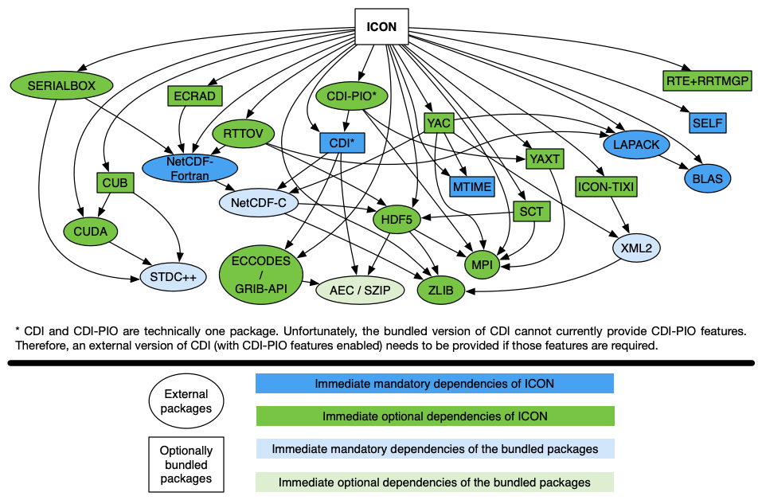

<!--
This file is written using Markdown language, which might make it difficult to
read it in a plain text editor. Please, visit ICON project page on DKRZ GitLab
(https://gitlab.dkrz.de/icon/icon) to see this file rendered or use a Markdown
viewer of your choice (https://www.google.com/search?q=markdown+viewer).
-->

# Table of contents
1. [Quick start](#quick-start)
2. [Configuration](#configuration)
    - [ICON dependencies](#icon-dependencies)
    - [Bundled libraries](#bundled-libraries)
    - [Compilers and tools](#compilers-and-tools)
    - [Compiler flags](#compiler-flags)
    - [Dynamic libraries](#dynamic-libraries)
    - [Configuration and building environments](#configuration-and-building-environments)
    - [Configuration wrappers](#configuration-wrappers)
    - [Out-of-source configuration (building)](#out-of-source-configuration-building)
3. [Building](#building)
    - [Source file collection](#source-file-collection)
    - [Preprocessing](#preprocessing)
    - [Source dependency tracking](#source-dependency-tracking)
        - [Code consistency checks](#code-consistency-checks)
        - [Compilation cascade prevention](#compilation-cascade-prevention)
    - [Building of the bundled libraries](#building-of-the-bundled-libraries)
    - [Source provenance collection](#source-provenance-collection)
4. [Running](#running)
    - [Out-of-build runs](#out-of-build-runs)
5. [FAQ](#faq)

# Quick start

The process of building ICON consists of two parts: *configuring* the options
and compiler flags, and *building* the source code with those options and flags.

The configuration step is normally done by running the
[./configure](./configure) script with command-line arguments, which, among
other things, tell the script where to locate libraries and tools required for
building. The list of arguments enabling a successful configuration might be
quite long and difficult to compose, therefore, instead of running the generic
[./configure](./configure) script directly, users are recommended to execute a
corresponding platform- or machine-specific *configuration wrapper* that sets
the required compiler and linker flags as well as the recommended set of
configure options. The wrappers can be found in the respective subdirectories of
the [./config](./config) directory.

For example, if you need to build ICON on
[Mistral@DKRZ](https://www.dkrz.de/up/systems/mistral) with OpenMP feature
enabled using Intel compiler, you can run:

```console
$ cd /path/to/icon
$ ./config/dkrz/mistral.intel --enable-openmp
```

Alternatively, you can create a directory and perform an *out-of-source* build:

```console
$ mkdir build && cd build
$ /path/to/icon/config/dkrz/mistral.intel --enable-openmp
```

This way, you can build ICON in several different configurations, i.e. with
different compilers and features, using the same copy of the source code.

> **_NOTE:_** If there is no configure wrapper script for your platform or
machine, refer to section [Configuration](#configuration) for information on how
to work with the [./configure](./configure) script directly.

The building step is done by running `make` command with an optional argument
specifying the number of jobs to run simultaneously. For example,

```console
$ make -j8
```

The result of the building &mdash; the executable file of ICON &mdash; is saved
to the `./bin` subdirectory of the build directory.

> **_NOTE:_** For more information on the building step, refer to section
[Building](#building).

The *runscripts* can be generated by running:

```console
$ ./make_runscripts
```

To run the model, switch to the `run` subdirectory of the build directory and
submit the runscript of your choice, for example:

```console
$ cd ./run && sbatch ./exp.atm_amip.run
```

> **_NOTE:_** For more information on the runscript generation and running the
model, refer to section [Running](#running).

# Configuration

The configuration step is done by calling the [configure](./configure) script
with arguments specifying the location of libraries and tools required for
building, as well as options enabling or disabling particular features of the
model. For example:

```console
$ ./configure CC=mpicc FC=mpif90 LIBS='-lnetcdff -lnetcdf -llapack -lblas' --disable-ocean --disable-coupling
```

> **_NOTE:_** Users are recommended to get familiar with the full list of
configuration options and their default values by running:
>```console
>$ ./configure --help
>```

The [configure](./configure) script of ICON is implemented using
[Autoconf](https://www.gnu.org/software/autoconf/) and its interface should be
familiar to those who have experience with
[Autotools](https://en.wikipedia.org/wiki/GNU_Autotools)-based building systems.

The following sections provide information on some features and implementation
details of the configuration process.

## ICON dependencies

[Fig. 1](#icon-depgraph) shows a partial dependency graph of the model. A
dependency can be either *mandatory* (i.e. the library is required regardless of
the specified configure options) or *optional* (i.e. the library is required
only if particular features of the model are enabled), and some of the
dependencies are provided together with the source code of ICON as git
submodules and refered to as *bundled* later in the text.

> **_NOTE:_** The term *bundled library* does not apply to all packages listed
in [.gitmodules](/.gitmodules): some of them, e.g. JSBACH and ART, have circular
dependencies with the ICON source code and therefore are treated as part of it.

<a name="icon-depgraph"/>

*Fig. 1. ICON dependency graph*

The list of libraries (packages) required for successful configuration and
building depends on the selected options. To make the configuration process more
transparent, the [configure](./configure) script does not accept paths to the
installation directories of the packages, which would be used to extend the
corresponding compiler flags. Instead, paths to the header and library files of
the packages must be provided by the user as compiler and linker flags, i.e. in
the `FCFLAGS`, `CPPFLAGS`, and `LDFLAGS` arguments. Moreover, the script does
not try to guess the list of libraries to be used, therefore all the `-l` linker
flags need to be specified in the `LIBS` argument in the correct order. The
recommended (topologically sorted) order for the `LIBS` argument is presented in
[Table 1](#icon-deptable), and the recommended order for the `FCFLAGS`,
`CPPFLAGS`, `LDFLAGS` is the reversed one.

<a name="icon-deptable">*Table 1. Topologically sorted list of the ICON dependency graph*</a>

| Linking order | Package | Dependency condition<sup><a name="f1-back" href="#f1">1</a></sup> | Required flags<sup><a href="#f1">1</a></sup> |
| :---: | :---: | :---: | :---: |
|  1 | [SELF](https://code.mpimet.mpg.de/projects/self-standard-extendible-library-for-fortran) | `--with-external-self` | `FCFLAGS='-I/path/to/libself/include' LDFLAGS='-L/path/to/libself/lib' LIBS='-lself'` |
|  2 | ICON-TIXI (a modified version of [TIXI](https://github.com/DLR-SC/tixi)) | `--enable-art --with-external-tixi` | `FCFLAGS='-I/path/to/tixi/include' LDFLAGS='-L/path/to/tixi/lib' LIBS='-licon_tixi'` |
|  3 | [YAC](https://doc.redmine.dkrz.de/YAC/html/) | `--enable-coupling --with-external-yac` | `FCFLAGS='-I/path/to/yac/include' LDFLAGS='-L/path/to/yac/lib' LIBS='-lyac'` |
|  4 | [XML2](http://www.xmlsoft.org/) | `--enable-coupling`<sup><a name="f2-back" href="#f2">2</a></sup> or `--enable-art`<sup><a name="f2-back" href="#f2">2</a></sup>| `CPPFLAGS='-I/path/to/libxml2/include/libxml2' LDFLAGS='-L/path/to/libxml2/lib' LIBS='-lxml2'` |
|  5 | [LAPACK](http://www.netlib.org/lapack/) (or analogue) | mandatory | `LDFLAGS='-L/path/to/lapack/lib' LIBS='-llapack'` (depends on the implementation) |
|  6 | [BLAS](http://www.netlib.org/blas/) (or analogue) | mandatory | `LDFLAGS='-L/path/to/blas/lib' LIBS='-lblas'` (depends on the implementation) |
|  7 | [MTIME](https://code.mpimet.mpg.de/projects/mtime) | `--with-external-mtime`<sup><a name="f3-back" href="#f3">3</a></sup> | `FCFLAGS='-I/path/to/mtime/include' CPPFLAGS='-I/path/to/mtime/include' LDFLAGS='-L/path/to/mtime/lib' LIBS='-lmtime'` |
|  8 | [SERIALBOX2](https://github.com/eth-cscs/serialbox2) | `--enable-serialization` | `FCFLAGS='-I/path/to/serialbox2/include' LDFLAGS='-L/path/to/serialbox2/lib' LIBS='-lSerialboxFortranShared'` |
|  9 | [CDI](https://code.mpimet.mpg.de/projects/cdi/) or CDI-PIO | `--with-external-cdi`<sup><a name="f4-back" href="#f4">4</a></sup> | `FCFLAGS='-I/path/to/libcdi/include' LDFLAGS='-L/path/to/libcdi/lib' LIBS='-lcdi_f2003 -lcdi'` (or `LIBS='-lcdi_f2003 -lcdipio -lcdi'`) |
| 10 | [ECCODES](https://confluence.ecmwf.int/display/ECC) or [GRIB-API](https://confluence.ecmwf.int/display/GRIB/Home) | `--enable-grib2 --without-external-cdi`<sup><a name="f5-back" href="#f5">5</a></sup> | `CPPFLAGS='-I/path/to/eccodes/include' LDFLAGS='-L/path/to/eccodes/lib' LIBS='-leccodes'` (or `LIBS='-lgrib_api'`) |
| 11 | [YAXT](https://www.dkrz.de/redmine/projects/yaxt/wiki) | `--enable-yaxt --with-external-yaxt` or `--enable-cdi-pio --with-external-yaxt`<sup><a name="f6-back" href="#f6">6</a></sup> | `FCFLAGS='-I/path/to/yaxt/include' LDFLAGS='-L/path/to/yaxt/lib' LIBS='-lyaxt'` |
| 12 | [SCT](https://code.mpimet.mpg.de/projects/performance-monitoring/wiki/Access_of_stored_performance_data) | `--enable-sct --with-external-sct` | `FCFLAGS='-I/path/to/sct/include' LDFLAGS='-L/path/to/sct/lib' LIBS='-lsct'` |
| 13 | RTTOV (a modified version of [RTTOV](https://www.nwpsaf.eu/site/software/rttov/)) | `--enable-rttov` | `FCFLAGS='-I/path/to/rttov/include' LDFLAGS='-L/path/to/rttov/lib' LIBS='-lradiance -lrttov10.2'` |
| 14 | [ECRAD](https://confluence.ecmwf.int/display/ECRAD/ECMWF+Radiation+Scheme+Home) | `--enable-ecrad --with-external-ecrad` | `FCFLAGS='-I/path/to/ecrad/include' LDFLAGS='-L/path/to/ecrad/lib' LIBS='-lradiation -lifsrrtm -lutilities -lifsaux'` |
| 15 | [RTE+RRTMGP](https://github.com/RobertPincus/rte-rrtmgp) | `--enable-rte-rrtmgp --with-external-rte-rrtmgp` | `FCFLAGS='-I/path/to/rte-rrtmgp/include' LDFLAGS='-L/path/to/rte-rrtmgp/lib' LIBS='-lrrtmgp -lrte'` |
| 16 | [NetCDF-Fortran](https://www.unidata.ucar.edu/software/netcdf/docs-fortran/) | mandatory | `FCFLAGS='-I/path/to/netcdf-fortran/include' LDFLAGS='-L/path/to/netcdf-fortran/lib' LIBS='-lnetcdff'` |
| 17 | [NetCDF-C](https://www.unidata.ucar.edu/software/netcdf/docs/) | `--without-external-cdi` or `--enable-coupling`<sup><a name="f7-back" href="#f7">7</a></sup> | `CPPFLAGS='-I/path/to/netcdf/include' LDFLAGS='-L/path/to/netcdf/lib' LIBS='-lnetcdf'` |
| 18 | [HDF5](https://support.hdfgroup.org/HDF5/) | `--enable-sct --without-external-sct` | `CPPFLAGS='-I/path/to/hdf5/include' LDFLAGS='-L/path/to/hdf5/lib' LIBS='-lhdf5'` |
| 19 | [AEC](https://gitlab.dkrz.de/k202009/libaec) or [SZIP](https://support.hdfgroup.org/doc_resource/SZIP/) | static linking | `LDFLAGS='-L/path/to/aec/lib' LIBS='-laec'` (or `LIBS='-lsz'`) |
| 20 | [MPI](https://www.mpi-forum.org/) (Fortran interface) | `--enable-mpi` or `--enable-yaxt --without-external-yaxt` or `--enable-coupling --without-external-yac`<sup><a name="f8-back" href="#f8">8</a></sup> | `FC='/path/to/mpi/bin/mpif90'` or `FCFLAGS='-I/path/to/mpi/include' LDFLAGS='-L/path/to/mpi/lib' LIBS='-lmpifort -lmpi'` (depends on the implementation) |
| 21 | [MPI](https://www.mpi-forum.org/) (C interface) | `--enable-mpi --enable-coupling --without-external-yac` or `--enable-yaxt --without-external-yaxt` or `--enable-mpi --enable-sct --without-external-sct` | `CC=/path/to/mpi/bin/mpicc` or `CPPFLAGS=-I/path/to/mpi/include LDFLAGS='-L/path/to/mpi/lib' LIBS='-lmpi'` (depends on the implementation) |
| 22 | [CUB](https://nvlabs.github.io/cub/) | `--enable-gpu --with-external-cub` | `NVCFLAGS=-I/path/to/cub`<sup><a name="f9-back" href="#f9">9</a></sup> |
| 23 | [CUDA](https://developer.nvidia.com/cuda-zone) | `--enable-gpu` | `LDFLAGS=-L/path/to/cuda/lib LIBS=-lcudart`<sup><a name="f10-back" href="#f10">10</a></sup> |
| 24 | [STDC++](https://gcc.gnu.org/onlinedocs/libstdc++/) | `--enable-gpu` | `LDFLAGS=-L/path/to/gcc/used/by/nvcc/lib LIBS=-lstdc++` |

1. <a name="f1"/> The dependency conditions and required flags are specified
assuming that the shared versions of the libraries containing `RPATH` entries
pointing to their dependencies are used. [↩](#f1-back)
2. <a name="f2"/> There are no shared versions of YAC and ICON-TIXI libraries,
which would enable implicit linking to XML2 library, therefore, the latter needs
to be linked explicitly regardless of whether external or the bundled versions
of YAC and ICON-TIXI are used. [↩](#f2-back)
3. <a name="f3"/> When the coupling is enabled (`--enable-coupling`) and an
external version of YAC (`--with-external-yac`) is used, the usage of an
external MTIME library (`--with-external-mtime`) is mandatory (must be the
library that YAC has been built with). [↩](#f3-back)
4. <a name="f4"/> Currently, the bundled version of CDI does not provide CDI-PIO
features, therefore the usage of an external version of CDI
(`--with-external-cdi`) is the only option when the parallel I/O features
(`--enable-cdi-pio`) are required. [↩](#f4-back)
5. <a name="f5"/> Another possible case when a special treatment for
ECCODES/GRIB-API library might not be expected but is required is when the
bundled version of YAXT (`--enable-yaxt --without-external-yaxt`) and an
external version of CDI (`--with-external-cdi`) are used. The configure script
of YAXT runs a check that links an executable using libtool and then runs it.
Since neither ECCODES nor GRIB-API is a libtool library (i.e. there are no `.la`
files for them), the resulting executable does not have the required `RPATH`
entry for it, which results into a false negative result of the check, which
fails the configuration with a misleading message. To circumvent this problem,
the path to the ECCODES/GRIB-API library must be passed to the linker before
running the configure script of ICON, e.g. by means of the `LD_LIBRARY_PATH`
environment variable. [↩](#f5-back)
6. <a name="f6"/> When the usage of the parallel features of CDI is enabled
(`--enable-cdi-pio`) and an external version of CDI (`--with-external-cdi`) is
used, the usage of an external YAXT library (`--with-external-yaxt`) is
mandatory (must be the library that CDI has been built with). [↩](#f6-back)
7. <a name="f7"/> There is no shared version of YAC library, which could link
NetCDF-C library implicitly, therefore the latter needs to be linked explicitly,
regardless of whether an external or the bundled version of YAC is used.
[↩](#f7-back)
8. <a name="f8"/> Both `mpif.h` and `mpi.mod` interfaces are required for the
bundled version of YAC. [↩](#f8-back)
9. <a name="f9"/> CUB is a header-only library and does not need additional
linker flags. [↩](#f9-back)
10. <a name="f10"/> Currently, the only Fortran compiler that supports all
features required to build the GPU version of ICON is PGI, which specifies
linker flags enabling CUDA automatically. [↩](#f10-back)

## Bundled libraries

As it was mentioned in the previous section, some of the libraries are bundled
together with the ICON source code. However, users can download and install
those libraries before configuring ICON and use them instead. This is controlled
by the `--with-external-<package>` arguments of the [configure](./configure)
script of ICON. The arguments accept either `yes` or `no`. If the usage of an
external version of a library is requested (i.e.
`--with-external-<package>=yes`), the compiler and linker flags, i.e. `FCFLAGS`,
`CPPFLAGS`, `LDFLAGS` and `LIBS`, are supposed to be extended accordingly (see
[Table 1](#icon-deptable)). The [configure](./configure) script of ICON fails if
the flags are not set correctly or enable a version of the library that is known
to be incompatible with ICON.

By default, the bundled versions of the libraries are used. In this case, the
[configure](./configure) script of ICON runs the configure scripts of the
libraries and extends the compiler and linker flags automatically. The arguments
that are passed to the configure scripts of the bundled libraries are composed
based on the arguments provided to the [configure](./configure) script of ICON
as follows:
- by default, the arguments are passed unchanged, which means that if you need
to give an additional argument to the configure script of a bundled library, you
can specify it when calling the [configure](./configure) script of ICON, even
though, the argument is not listed in its help message;
- arguments that potentially break the configuration and building of ICON are
filtered out, for example, it is important that the bundled libraries are linked
statically, therefore the argument `--enable-shared` is never passed to the
configure scripts that support it;
- the list of arguments is extended with ones that enforce consistent building,
for example, the configure scripts of the libraries receive additional arguments
`--disable-shared` and `--enable-static` (see calls to the `ACX_CONFIG_SUBDIR`
macro in [configure.ac](./configure.ac) for the full lists of argument
modifications done by the [configure](./configure) script of ICON for each
particular library);
- compiler flags are modified as described in section
[Compiler flags](#compiler-flags).

> **_NOTE:_** Oftentimes, error and warning messages that a printed at configure
time are emitted not by the [configure](./configure) script of ICON but by the
configure scripts of the bundled libraries. Each of the scripts generates its
own `config.log` file, which can help in better understanding of the reported
issue. The log files are put to the corresponding subdirectories of the
`./externals` directory residing in the root build directory of ICON.

## Compilers and tools

Compilers and tools to be used for building are read by the
[configure](./configure) script of ICON from the following environment
variables:
- `FC` &mdash; Fortran compiler command;
- `CC` &mdash; C compiler command;
- `NVCC` &mdash;
[NVIDIA CUDA Compiler](https://developer.nvidia.com/cuda-llvm-compiler) command
(used only when the GPU support is enabled);
- `PYTHON` &mdash; [Python](https://www.python.org/) interpreter command (used
for [source dependency tracking](#source-dependency-tracking) and some of the
[preprocessing](#preprocessing) steps);
- `PERL` &mdash; [Perl](https://www.perl.org/) interpreter command (used for
[source provenance collection](#source-provenance-collection));
- `CLAW` &mdash; [CLAW](https://claw-project.github.io/) compiler (source
preprocessor) command (see section [Preprocessing](#preprocessing) for more
details);
- `FPP` &mdash; Fortran preprocessor command (used when explicit Fortran
preprocessing is enabled, see section [Preprocessing](#preprocessing) for more
details), must treat the first positional command-line argument as the path to
the input source file and print the result to the standard output stream;
- `SB2PP` &mdash; [Serialbox2](https://gridtools.github.io/serialbox/)
preprocessor command (used when the Serialbox2 serialization is enabled, see
section [Preprocessing](#preprocessing) for more details);
- `MPI_LAUNCH` &mdash; interactive (synchronous) MPI launcher command (used by
the bundled libraries for configure-time checks).

If the variables are set, the [configure](./configure) script will check whether
their values meet the requirements, otherwise the script will try to guess
suitable values for them. Thus, if you want to make sure that a particular
command for a particular operation is used, you need to specify the
corresponding variable explicitly. For example, the usage of NAG compiler is
enforced with the following additional command-line argument of the
[configure](./configure) script:

```console
$ ./configure FC=nagfor <other arguments>
```

## Compiler flags

The configure script supports several groups of compiler flags. Each group is
associated with one of the following environment variables:
- `FCFLAGS` &mdash; Fortran compiler flags to be used at the configuration
**and** building stages when compiling **and** linking ICON **and** the bundled
libraries (the list of flags might be extended by the configure scripts, e.g. to
enable required compiler features, however, in contrast to standard
[Autoconf](https://www.gnu.org/software/autoconf/)-based scripts, the
[configure](./configure) script of ICON does not set `FCFLAGS` to `-g -O2` by
default);
- `ICON_FCFLAGS` &mdash; Fortran compiler flags to be appended to `FCFLAGS` at
the building stage when compiling **and** linking ICON;
- `ICON_OCEAN_FCFLAGS` &mdash; Fortran compiler flags to be appended to
`FCFLAGS` at the building stage when compiling the ocean component of ICON, i.e.
the Fortran source files residing in subdirectories of the
[src/hamocc](./src/hamocc), [src/ocean](./src/ocean), and
[src/sea_ice](./src/sea_ice) directories (defaults to `ICON_FCFLAGS`, which can
be overridden by setting the variable to an empty value: `ICON_OCEAN_FCFLAGS=`);
- `ICON_BUNDLED_FCFLAGS` &mdash; Fortran compiler flags to be appended to
`FCFLAGS` when configuring the bundled libraries (defaults to `ICON_FCFLAGS`,
which can be overridden by setting the variable to an empty value:
`ICON_BUNDLED_FCFLAGS=`);
- `CFLAGS` &mdash; C compiler flags to be used at the configuration **and**
building stages when compiling ICON, as well as compiling **and** linking the
bundled libraries (the list of flags might be extended by the configure scripts,
e.g. to enable required compiler features, however, in contrast to standard
[Autoconf](https://www.gnu.org/software/autoconf/)-based scripts, the
[configure](./configure) script of ICON does not set `CFLAGS` to `-g -O2` by
default);
- `CPPFLAGS` &mdash; C preprocessor flags to be used at the configuration
**and** building stages when compiling ICON, as well as compiling **and**
linking the bundled libraries;
- `ICON_CFLAGS` &mdash; C compiler flags to be appended to `CFLAGS` at the
building stage when compiling ICON;
- `ICON_BUNDLED_CFLAGS` &mdash; C compiler flags to be appended to `CFLAGS` when
configuring the bundled libraries (defaults to `ICON_CFLAGS`, which can be
overridden by setting the variable to an empty value: `ICON_BUNDLED_CFLAGS=`);
- `NVCFLAGS` &mdash;
[NVIDIA CUDA Compiler](https://developer.nvidia.com/cuda-llvm-compiler) flags to
be used at the configuration **and** building stages when compiling ICON (the
list of flags might be extended by the [configure](./configure) script, e.g. to
enable required compiler features);
- `CLAWFLAGS` &mdash; extra [CLAW](https://claw-project.github.io/) compiler
flags to be used at the building stage together with the flags that are composed
automatically based on the [configure](./configure) options (e.g. Fortran
compiler flags specifiying search paths (`-I<path>`) and macros
(`-D<macro=value>`) found in `FCFLAGS` are passed to the CLAW preprocessor);
- `LDFLAGS` &mdash; common Fortran **and** C compiler flags to be used at the
configuration **and** building stages when linking ICON **and** the bundled
libraries;
- `LIBS` &mdash; a list of libraries (see [Table 1](#icon-deptable) for the
recommended order) to be passed to the linker by the Fortran compiler when
linking ICON **and** to the configure scripts of the bundled libraries (which
might use both Fortran and C compiler for linking).

> **_NOTE:_** It is recommended to specify the environment variables that
influence the configuration as command line arguments of the
[configure](./configure) script in the form `VAR=VALUE`, for example:
>```console
>$ ./configure FCFLAGS='-O2 -g' <other arguments>
>```

The general recommendation to follow when composing the flags is:
1. Flags specifying search paths for header and module files, i.e. the
`-I<path>` flags, should be specified as `FCFLAGS` and `CPPFLAGS`, depending on
whether they need to be passed to Fortran or C compiler, respectively.
2. By default, other flags, e.g. the optimization ones, that are meant for
Fortran and C compilers should be appended to `FCFLAGS` and `CFLAGS`,
respectively.
3. Fortran and C compiler flags that need to be used when compiling and linking
ICON but at the same time can break the configuration (a flag is to restrictive
for the configure checks to pass, e.g. `-fimplicit-none` for Gfortran) or the
functionality of the bundled libraries (e.g. the optimization level required
for ICON is too high and leads to errors in the functionality of the bundled
libraries) can be put to `ICON_FCFLAGS` and `ICON_CFLAGS`, respectively.
4. Special optimization flags for the ocean component of ICON can be put to
`ICON_OCEAN_FCFLAGS`.
5. Fortran and C compiler flags that need to be used when compiling and linking
the bundled libraries but at the same time conflict with the flags required for
ICON (e.g. you want to compile ICON with `-O3` flag but the bundled libraies
need to be compiled with `-O2`) can be specified as `ICON_BUNDLED_FCFLAGS` and
`ICON_BUNDLED_CFLAGS`, respectively.

## Dynamic libraries

For each `-L<path>` flag found in the `LDFLAGS` and `LIBS` variables, the
[configure](./configure) script of ICON generates an additional linker flag that
puts the `<path>` on the list of runtime library search paths of the ICON
executable. This allows for automatic location of the required libraries by the
*dynamic linker* at the runtime. The flags are appended to `LDFLAGS` at the
build time and their actual form depends on the Fortran compiler in use. By
default, the flags are composed using the template `-Wl,-rpath -Wl,<path>` with
currently the only exception for NAG compiler, which accepts the flags in the
form `-Wl,-Wl,,-rpath -Wl,-Wl,,<path>`. If the `-rpath` flags generated by the
configure script break the building or you perform a completely static linking,
you can disable the feature by calling the [configure](./configure) script with
an additional argument `--disable-rpaths`.

> **_NOTE:_** The GNU Linker (GNU ld) implements a feature called `new-dtags`.
If this feature is enabled (usually by default), the linker treats the
`-rpath <path>` flag differently: besides setting the `DT_RPATH` attribute of
the output shared library file to the `<path>`, it also sets the `DT_RUNPATH`
attribute of the file to the same value. This alters the way the dynamic linker
locates the required dynamic libraries at the runtime: if the dynamic linker
finds a `DT_RUNPATH` attribute, it **ignores** the value of the `DT_RPATH`
attribute, with the effect that the `LD_LIBRARY_PATH` environmane variable is
checked first and the paths in the `DT_RUNPATH` attribute are only searched
afterwards. Moreover, the dynamic linker does not search `DT_RUNPATH` locations
for transitive dependencies, unlike `DT_RPATH`. Therefore, it is important to
keep in mind that:
>  1. The ICON executable is not agnostic to the environment if it has been
linked with the `new-dtags` feature enabled: the `LD_LIBRARY_PATH` environment
variable can override the rpath entries set by the linker. The feature can be
disabled by appending the `-Wl,--disable-new-dtags` flags to the `LDFLAGS`
variable.
>  2. If an immediate ICON dependency, e.g. `libnetcdf.so`, has at least one
`DT_RUNPATH` entry but none of them points to a directory containing one of the
libraries required by that dependency, e.g. `libsz.so`, the dynamic linker will
not be able to locate the latter at the runtime even if the ICON executable has
been linked without the `new-dtags` feature and an `-Wl,-rpath` flag pointing to
the right location, e.g.
`-Wl,--disable-new-dtags -Wl,-rpath -Wl,/path/to/libsz`. A possible workaround
for this is to make the secondary dependency of ICON a primary one by
*overlinking* (i.e. linking to a library, which is not used by the executable
directly) to it, e.g. by adding the `-lsz` to the `LIBS` variable. This way, the
dependency will become a non-transitive one and the dynamic linker will be able
to locate it using either `DT_RUNPATH` or `DT_RPATH` entries of the ICON
executable.
>
> For more details, refer to the man pages of the linker (`man ld`) and the
dynamic linker (`man ld.so`).

> **_NOTE:_** Some of the bundled libraries employ
[Libtool](https://www.gnu.org/software/libtool/), which is known to be **not**
fully compatible with some compilers. For example, the flags
`-Wl,-Wl,,-rpath -Wl,-Wl,,<path>`, which are valid for NAG compiler, are
incorrectly transformed by Libtool into
`-Wl,-Wl -Wl,"" -Wl,-rpath -Wl,-Wl -Wl,"" -Wl,<path>`. A possible solution
for this problem is to add the flags in the form understood by NAG compiler not
to `LDFLAGS` but to `ICON_FCFLAGS` and make sure that the bundled libraries,
especially the Libtool-based ones, will not receive them:
`ICON_BUNDLED_FCFLAGS=`.

> **_NOTE:_** The generated `-rpath` flags are applied only at the building
stage and for the ICON executable only. However, some of the checks performed by
the [configure](./configure) script of ICON and the configure scripts of the
bundled libraries imply running executables linked with the flags listed in the
`LIBS` variable. To prevent those checks from false negative results, which
oftentimes are reported with misleading messages, the dynamic linker needs to be
able to locate all the libraries referenced in the `LIBS` variable. A way to
achive that is to list paths to the libraries in the `LD_LIBRARY_PATH` variable
and export it, i.e. run `export LD_LIBRARY_PATH="<path1>:<path2>:..."` before
running the configure script.

## Configuration and building environments

It is important that both the configuration and the building stages are
performed in the same environment, i.e. the environment variables that might
influence the way the compilers and the linker work are set to the same values
when running the [configure](./configure) script and when running the `make`
command for building (see also section
[Initialization of the building environment](#initialization-of-the-building-environment)).
For example, NAG compiler will not work if the environment variable
`NAG_KUSARI_FILE` is not set properly. Keeping track of all the steps required
to re-initialize the environment for the building stage, e.g. when the
configuration stage has already been done but in another terminal session, might
be challenging, especially in HPC environments offering multiple compilers and
libraries.

One way to make sure that the configuration and the building environments are
consistent is to set the `BUILD_ENV` argument of the [configure](./configure)
script to a set of shell commands that initialize the environment variables with
the required values. If the `BUILD_ENV` variable is not empty, the
[configure](./configure) script will run the commands it contains before running
any checks. Additionally, the commands will be saved to the `Makefile`, so they
will be executed each time the `make` command is launched for building. The
shell script that is provided as value of the `BUILD_ENV` argument must be a
one-liner ending with a semicolon (;) symbol, for example:

```console
$ ./configure BUILD_ENV='. /etc/profile.d/modules.sh; module purge; module load intel;' <other arguments>
```

Also, a proper implementation of the `BUILD_ENV` script allows for switching
between multiple build directories (see section
[Out-of-source configuration (building)](#out-of-source-configuration-building))
without having to re-initialize the environment accordingly.

## Configuration wrappers

Real case configuration commands might be rather long and complex. For example,
below, you can find an example of the configuration command for
[Mistral@DKRZ](https://www.dkrz.de/up/systems/mistral):

```console
$ ./configure \
  AR=xiar \
  BUILD_ENV=". /sw/rhel6-x64/etc/profile.mistral; \
             . ./config/dkrz/module_switcher; \
             switch_for_module intel/17.0.6 openmpi/2.0.2p2_hpcx-intel14;" \
  CC=mpicc \
  CFLAGS='-gdwarf-4 -O3 -qno-opt-dynamic-align -ftz -march=native -g' \
  CPPFLAGS="-I/sw/rhel6-x64/hdf5/hdf5-1.8.18-parallel-openmpi2-intel14/include \
            -I/sw/rhel6-x64/netcdf/netcdf_c-4.4.0-parallel-openmpi2-intel14/include \
            -I/sw/rhel6-x64/grib_api/grib_api-1.15.0-gcc48/include \
            -I/usr/include/libxml2" \
  FC=mpif90 \
  FCFLAGS="-I/sw/rhel6-x64/netcdf/netcdf_fortran-4.4.3-parallel-openmpi2-intel14/include \
           -gdwarf-4 -g -march=native -pc64 -fp-model source" \
  ICON_FCFLAGS='-O2 -assume realloc_lhs -ftz' \
  ICON_OCEAN_FCFLAGS='-O3 -assume norealloc_lhs -reentrancy threaded -qopt-report-file=stdout -qopt-report=0 -qopt-report-phase=vec' \
  LDFLAGS="-L/sw/rhel6-x64/hdf5/hdf5-1.8.18-parallel-openmpi2-intel14/lib \
           -L/sw/rhel6-x64/netcdf/netcdf_c-4.4.0-parallel-openmpi2-intel14/lib \
           -L/sw/rhel6-x64/netcdf/netcdf_fortran-4.4.3-parallel-openmpi2-intel14/lib \
           -L/sw/rhel6-x64/grib_api/grib_api-1.15.0-gcc48/lib \
           -mkl=sequential" \
  LIBS='-Wl,--as-needed -lxml2 -lgrib_api -lnetcdff -lnetcdf -lhdf5' \
  MPI_LAUNCH=mpiexec \
  --enable-intel-consistency \
  --enable-vectorized-lrtm \
  --enable-parallel-netcdf
```

Obviously, repeatedly composing such a command is exhausting and error-prone.
Therefore, each team involved in the development of ICON is encouraged to
implement and maintain *configuration wrappers*, which would simplify the
configuration stage for their users. The wrappers should be put in a
subdirectory with a relevant name of the [./config](config) directory. Although
there are no hard requirements on how the scripts should be implemented, we
recommend to consider the following features:

1. Pass the command-line arguments of the wrapper script to the
[configure](./configure) script, so that the users are able to override the
default values of the configure options, for example:
    ```console
    $ ./config/dkrz/mistral.intel --enable-openmp
    ```
    Also, account for the case of calling the wrapper with the `--help` argument.
2. Account for out-of-source building:
    - the wrapper script should be able to locate the [configure](./configure)
    script when called from a directory other than the source root directory,
    for example:
        ```bash
        SCRIPT_DIR=$(cd "$(dirname "$0")"; pwd)
        ICON_DIR=$(cd "${SCRIPT_DIR}/../.."; pwd)
        "${ICON_DIR}/configure" <a list of predefined arguments> "$@"
        ```
    - the wrapper script should prepare the current working directory for the
    following runscript generation (see section [Running](#running) for more
    details).
3. Prepend the `LIBS` variable with `-Wl,--as-needed` flag so that the actual
list of the libraries the ICON executable depends on would include only those
required for the particular configuration of the model (see the man pages of
the linker for more details: `man ld`).
4. Allow for running the `make check` command (see section
[Building of the bundled libraries](#building-of-the-bundled-libraries) for more
details) by extending the `LD_LIBRARY_PATH` environmane variable in the
`BUILD_ENV` script, instead of doing so in the wrapper script itself.

## Out-of-source configuration (building)

The building system of ICON supports so-called *out-of-source* builds. This
means that you can build ICON in a directory other than the *source* root
directory. The main advantage of this is that you can easily switch between
several different configurations (each in its own *build* directory) of the
model, while working on the same source code. Hence, it is possible to introduce
changes into the source code and test them with different compilers, flags and
options without having to re-configure the model or copy the updated source
files to other directories.

The [configure](./configure) script (also when called via a configuration
wrapper) prepares the *current working directory* for the following building.
The particular case of the current working directory being the source root
directory is called *in-source* configuration.

> **_NOTE:_** It is not allowed to mix in-source and out-of-source builds:
the source directory must be cleaned from the files generated as a result of
a prior in-source configuration and building before an out-of-source
configuration can take place.

The following example shows how ICON can be configured on
[Mistral@DKRZ](https://www.dkrz.de/up/systems/mistral) in two different
directories using Intel and GCC compiler toolchains (assuming that the source
root directory of ICON is `/path/to/icon-srcdir`):

```console
$ mkdir intel && cd intel
$ /path/to/icon-srcdir/config/dkrz/mistral.intel
$ cd ..
$ mkdir gcc && cd gcc
$ /path/to/icon-srcdir/config/dkrz/mistral.gcc
$ cd..
```

As a result of the previous commands, you will have two directories `intel` and
`gcc` prepared for the following building of ICON using Intel and GCC compilers,
respectively.

# Building

The building stage is done with [GNU make](https://www.gnu.org/software/make/)
upon successful completion of the configuration stage. The oldest supported
version of `make` is **3.81**, however, it has significant limitations and it
is recommended to use version **4.1** or later.

The building step is done by running `make` command with an optional argument
specifying the number of jobs to run simultaneously. For example:

```console
$ make -j8
```

> **_NOTE:_** Users are recommended to get familiar with the list of basic
*targets*, i.e. supported subcommands, by running:
>```console
>$ make help
>```

The *makefiles* of ICON, i.e. the instructions for `make` on how to build the
model, are generated at the final step of the configuration stage based on the
template files. Unlike most of the
[Autotools](https://en.wikipedia.org/wiki/GNU_Autotools)-based packages, the
makefile templates of ICON are **not** generated automatically with
[Automake](https://www.gnu.org/software/automake/) but implemented manually. The
main reasons for that are, first, avoid the need to maintain an explicit list of
source files, and, second, keep the makefiles human-readable and, therefore,
human-hackable, which is often required for productive model development.

By default, `make` reads the instructions from a file called `Makefile`, which
in the case of ICON is generated based on the [Makefile.in](./Makefile.in)
template and is mainly responsible for the initialization of the building
environment. The initialization is performed by the shell script provided to
the [configure](./configure) script as the `BUILD_ENV` argument (see section
[Configuration and building environments](#configuration-and-building-environments)).
The script is saved in the `Makefile`. Each time `make` is executed in the root
of the ICON build directory, it reads the `Makefile`, runs the initialization
script and
[recursively](https://www.gnu.org/software/make/manual/html_node/Recursion.html)
executes itself in the same directory but with another input makefile called
`icon.mk`. The latter is generated based on the [icon.mk.in](./icon.mk.in)
template and contains the instructions on how to perform the following building
steps required to generate the ICON executable.

> **_NOTE:_** All modifications of the makefiles and other files that are
automatically generated at the configuration stage can be reverted by calling
the `./config.status` script residing in the build directory.

The following sections provide information on some features and implementation
details of the building process.

> **_NOTE:_** By default, `make` produces very minimalistic output to the
standard output stream. This allows for better recogniction of the warnings
messages emitted by the compilers and other tools. This can be altered either at
the configuration stage by calling the [configure](./configure) script with an
additional option `--disable-silent-rules` or at the building stage by calling
`make` with an additional command-line argument `V`, which can be set either to
`1` (enable verbose output) or to `0` (disable verbose output). For example, if
you want to see the exact commands executed by `make`, you can run:
>```console
>$ make V=1 <other arguments>
>```

## Source file collection

The list of source files that need to be compiled to produce the ICON executable
is generated dynamically each time the `make` command is executed. This is done
using `find` command (both [GNU](https://www.gnu.org/software/findutils/) and
[BSD](https://www.freebsd.org/cgi/man.cgi?find(1)) versions are supported) with
the assumption that the source files have the following filename extensions:

- `.f90` &mdash; Fortran source files, regardless of whether they contain
Fortran preprocessor directives;
- `.inc` &mdash; Fortran header files included with the Fortran preprocessor
`#include` directives, e.g. `#include "filename.inc"`;
- `.incf` &mdash; Fortran header files included with the Fortran `INCLUDE`
statements, e.g. `include 'filename.incf'` (these files are not allowed to have
Fortran preprocessor directives);
- `.c` &mdash; C source files;
- `.cu` &mdash; CUDA source files.

The list of source files is a result of recursive search for files that have
the aforementioned extenions and reside in the [src](./src) and
[support](./support) subdirectories of the source root directory of ICON.
Additionaly, depending on the whether the corresponding components of the model
were enabled at the configuration stage, the list is extended with files Fortran
source files from the `./externals/jsbach` and `./externals/art` subdirectories.

> **_NOTE:_** In general, you can extend the source base of ICON just by adding
the source files to the [src](./src) subdirectory of the source root directory
of ICON.

## Preprocessing

Depending on the configuration, Fortran source and header files undergo one or
more of the following preprocessing precedures.
1. Fortran source files residing in the `./externals/jsbach/src` are
preprocessed with the
[dsl4jsb.py](https://gitlab.dkrz.de/jsbach/jsbach/blob/master/scripts/dsl4jsb/dsl4jsb.py)
script. This is done only if the JSBACH component has been enabled at the
configuration stage (`--enable-jsbach`). Otherwise, the source files of the
component are completely ignored. The result of this procedure is stored to the
`./pp/jsb` subdirectory of the root build directory.
2. Depending on whether the *CLAW preprocessing* (`--enable-claw`) is enabled,
the result of the previous step (currently, only JSBACH files are optionally
preprocessed at this step) are preprocessed with the
[CLAW](https://claw-project.github.io/) compiler. The result of this procedure
is stored to the `./pp/claw` subdirectory.
> **_NOTE:_** Unlike the rest of the preprocessing steps, the instructions for
> CLAW preprocessing are moved to a separate makefile called `claw.mk`, which
> is generated based on the [claw.mk.in](./claw.mk.in) template. This is done
> to employ the
> [.NOTPARALLEL](https://www.gnu.org/software/make/manual/html_node/Special-Targets.html#index-parallel-execution_002c-overriding)
> feature of GNU make, which is required to meet the limitation of the CLAW
> compiler manifested in the fact that the files must be processed serially.
3. Depending on whether the *explicit Fortran preprocessing* is enabled
(`--enable-explicit-fpp`), the results of the **actual** previous preprocessing
step, together with Fortran source and header files of ICON (including the ART
component, if enabled) that have not been preprocessed yet, are treated as
follows:
    - `.f90` files are preprocessed with the standard Fortran preprocessor;
    - `.inc` files are withdrown from further preprocessing since their contents
    are supposed to be injected into the output of the Fortran preprocessor when
    processing `.f90` files that include them;
    - `.incf` files that do **not** reside in the common
    [include](./src/include) directory are copied as-is to the corresponding
    subdirectories of the output directory, so they can be later found by the
    Fortran compiler without additional search path flags (`.incf` files that
    are stored in the common directory do not need to be copied because the
    compiler is always called with the `-I/path/to/icon-srcdir/src/include`
    search path flag and therefore is able to locate them).
    
    The result of this procedure is stored to the `./pp/fpp` subdirectory.
4. If the *Serialbox2 serialization* is enabled (`--enable-serialization`), the
results of the **actual** previous preprocessing step, as well as Fortran
source and header files of ICON (including the ART component, if enabled) that
have not been preprocessed yet, are treated as follows:
    - `.f90` files are preprocessed with the
[corresponding script](https://github.com/GridTools/serialbox/blob/master/src/serialbox-python/pp_ser/pp_ser.py)
of the [Serialbox2](https://gridtools.github.io/serialbox/) toolkit;
    - `.inc` files, if not withdrown at the previous step, are preprocessed with
    the same script as for `.f90` files and an additional search path flag
    `-I/path/to/icon-builddir/pp/sb2/src/include` is prepended to the list of
    Fortran compiler flags, so the compiler would later prefer the 
    **preprocessed** versions of the files over the original ones residing in
    the common [include](./src/include) directory;
    - `.incf` that do **not** reside in the common [include](./src/include)
    directory are copied as-is to the corresponding subdirectories of the output
    directory (for the same reason as in the case of the explicit Fortran
    preprocessing)
    The result of this procedure is stored to the `./pp/sb2` subdirectory.

> **_NOTE:_** The explicit Fortran preprocessing is enabled automatically when
the Serialbox2 serialization is enabled. You can override this by disabling the
preprocessing with the `--disable-explicit-fpp` option.

The output directories of the preprocessing steps have the same layout as the
directories containing their input files and the output files have the same
basenames as the corresponding intput files. For example if the original source
file of JSBACH `/icon-srcdir/externals/jsbach/src/base/mo_jsb_base.f90`
is preprocessed by each of the preprocessing steps, the corresponding output
files are saved as follows:
- `/icon-build/pp/jsb/src/base/mo_jsb_base.f90` &mdash; JSBACH preprocessing
output;
- `/icon-build/pp/claw/pp/jsb/src/base/mo_jsb_base.f90` &mdash; CLAW
preprocessing output;
- `/icon-build/pp/fpp/pp/claw/pp/jsb/src/base/mo_jsb_base.f90` &mdash; explicit
Fortran preprocessing output;
- `/icon-build/pp/sb2/pp/fpp/pp/claw/pp/jsb/src/base/mo_jsb_base.f90` &mdash;
Serialbox2 preprocessing output.

> **_NOTE:_** In contrast to the original source files residing in the source
directory, output files of the preprocessing steps are treated by `make` by
their absolute paths. This is done to avoid potential ambiguity between the
preprocessed files residing in the current build directory and the preprocessed
files in the source directory generated as a result of a prior in-source
configuration and building.

> **_NOTE:_** Source files are additionaly preprocessed with the corresponding
standard language-specific (i.e. Fortran, C, CUDA) preprocessors as part of the
compilation process. In contrast to the procedures described in this section,
the compilation-time preprocessing is non-optional and run by the compilers
*implicitly*.

## Source dependency tracking

Before the compilation can take place, it is required to identify the exact list
of source files that need to be compiled in order to produce the ICON
executable. The actual content of the list depends not only on how the code is
[configured](#configuration), possible modifications of the source code made
since the last call of `make` need to be taken into account too. Moreover, in
the case of Fortran source files, the compilation order becomes important since
a source file declaring a Fortran module must be compiled before any other
source file using that module. Both tasks are accomplished as follows.

Once the [preprocessing](#preprocessing) is finished, all source files of ICON
(as well as JSBACH and ART, if enabled) or their **final** preprocessed versions
are processed with the [dependency generator](./utils/mkhelper/depgen.py). The
tool parses each source file, detects which header and module files are required
for its succesful compilation, and stores this information in the form of a
makefile. The makefiles a then read by `make` and the
[dependency listing script](./utils/mkhelper/deplist.py). The former makes sure
that the source files are compiled in the right order, the latter identifies the
list of source files that need to be compiled.

> **_NOTE:_** The [dependency listing script](./utils/mkhelper/deplist.py)
recognizes only the basic makefile syntax. For example, it does not support
[variables](https://www.gnu.org/software/make/manual/make.html#Using-Variables)
and [functions](https://www.gnu.org/software/make/manual/make.html#Functions).

The [dependency generator](./utils/mkhelper/depgen.py) recognizes preprocessor
`#include`, `#if` and the associated directives as well as Fortran `INCLUDE`,
`USE` and `MODULE` statements. If the usage of a module or a header file is
surrounded with the `#ifdef SOME_MACRO` and `#endif` directives, it will be put
on the list of files required for the compilation only if the macro `SOME_MACRO`
is defined. The list of macro definitions enabling various features of the model
is generated at the [configuration](#configuration) stage in the form of
compiler flags, e.g. `-DSOME_MACRO -DSOME_OTHER_MACRO`, which are appended to
`FCFLAGS`. This way, some Fortran modules do not need to be generated in
particular configurations of the model and, therefore, the source files
declaring them are not compiled.

> **_NOTE:_** There are two types of source dependencies that cannot be detected
by the [dependency generator](./utils/mkhelper/depgen.py).
Undetectable dependencies of the first type are related to
[C/Fortran interoperability](http://fortranwiki.org/fortran/show/C+interoperability):
if a Fortran source file contains a declaration of a binding to a function
defined in a C source file, the dependency of the respective object files must
be reflected in the recipe for target `c_binding.d` of the
[icon.mk.in](./icon.mk.in) template. The second type of undetectable
dependencies is associated with Fortran external procedures: if a Fortran source
file contains a call to an external procedure, i.e. a function or a subroutine
that is not part of any Fortran module, the dependency of the respective object
files must be specified in the recipe for target `extra_f90.d` of the
[icon.mk.in](./icon.mk.in) template.

The [dependency listing script](./utils/mkhelper/deplist.py) reads the
dependency makefiles, builds a source dependency graph and traverses it starting
with the vertex associated with the `src/drivers/icon.o` object file. Each
vertex of the graph accessible from the starting one is printed to the output.
The output is then filtered by `make` in order to generate the list of object
files required for the ICON executable. This is the main purpose of the listing
script. Additionaly, the tool can run
[code consistency checks](#code-consistency-checks) described in the following
subsection.

### Code consistency checks

Each failed code consistency check run by the
[dependency listing script](./utils/mkhelper/deplist.py) is reported to the
standard error stream. The identified problems are expressed in terms of files
and makefile dependencies and, therefore, require additional explanation
provided in this subsection. Normally, the codebase is kept consistent and users
do not see the messages described below until they introduce a modification to
the source code that breaks the consistency. Currently, the
[dependency listing script](./utils/mkhelper/deplist.py) checks the source
dependency graph for the following problems:

1. **Two or more Fortran source files declare modules with the same name.**
    
    This type of inconsistency is reported as follows:
    ```
    deplist.py: WARNING: 'mod/some_module.mod.proxy' has more than one immediate prerequisite matching pattern '*.o':
        some/dir/some_file.o
        some/other/dir/some_other_file.o
    ```
    This means that the module `some_module` is declared twice. The first
    declaration is found in the file `some/dir/some_file.f90` and the second
    declaration is found in `some/other/dir/some_other_file.f90`.

2. **Two or more Fortran modules circularly depend on each other.**
    
    This type of inconsistency is reported as follows:
    ```
    deplist.py: WARNING: the dependency graph has a cycle:
        src/drivers/icon.o
        ...
        mod/some_module.mod.proxy
        some/dir/some_file.o
        mod/some_module_1.mod.proxy <- start of cycle
        some/other/dir/some_file_1.o
        mod/some_module_2.mod.proxy
        some/other/dir2/some_file_2.o
        mod/some_module_1.mod.proxy <- end of cycle
    ```
    This reads as that the module `some_module_1` (declared in
    `some/dir/some_file_1.f90`) uses module `some_module_2`
    (declared in `some/other/dir/some_file_2.f90`), which in turn uses
    `some_module_1`. Usually, this means that the compilation of
    `some/dir/some_file_1.f90` will fail.

3. **A Fortran module is used but not declared.**
    
    This problem is reported by the dependency listing script with the
    following message:
    ```
    deplist.py: WARNING: 'mod/missing_module.mod.proxy' does not have an immediate prerequisite matching any of the patterns: '*.o'
    ```
    This means that the module `missing_module` is used in one of the source
    files but there is no Fortran source file in the ICON codebase that declares
    it.

> **_NOTE:_** Missing Fortran modules are additionaly reported by `make` with
the message:
>```
>Cannot find Fortran source file providing module 'missing_module'.
>```
>However, it might be the case that the module is not actually missing but just
>not part of the ICON codebase, e.g. `mpi`, `sct`, `yaxt`, etc. Such modules are
>external to ICON and need to be explicitly specified as such in the file
>`depgen.f90.config` residing in the current build directory. The file is
>generated at configuration time based on a template file residing in the
>source directory. Therefore, in order to make the modifications persistent,
>you need to introduce them in the file
>[depgen.f90.config.in](./depgen.f90.config.in).

### Compilation cascade prevention

It is important, especially for the development process, that the modifications
of the source code done after the initial compilation trigger as few
recompilations as possible. One of the basic features of `make` is to keep track
of the file modification timestamps. Based on the information from the makefiles
generated by the [dependency generator](./utils/mkhelper/depgen.py), the tool
triggers recompilation of a source file only if the file itself or a header file
it includes, or a Fortran module file it uses has been modified since the last
execution. Unfortunately, most of the Fortran compilers (with an exception of
Gfortran) update the module files even if their relevant contents do not change,
i.e. the modification timestamp of a module file gets updated even if the
declaration of the associated Fortran module in the source file remains the
same. This leads to so-called *compilation cascades*.

Partially, this issue is circumvented in the building system of ICON as follows.
1. If a Fortran source file `filename.f90` uses a module `modulename`, the
corresponding dependency makefile `filename.f90.d` (created by the
[dependency generator](./utils/mkhelper/depgen.py)) gets an entry declaring the
dependency of the respective object file on a module *proxy* file:
    ```make
    filename.o: mod/modulename.mod.proxy
    ```
2. When the compilation of the file declaring the module `modulename` takes
place for the first time, the original module file `mod/modulename.mod`
generated by the compiler is backed up under the name
`mod/modulename.mod.proxy`.
3. When `make` checks whether the object file `filename.o` needs to be updated
(i.e. the source file `filename.f90` needs to be recompiled), it compares the
potentially updated original module file `mod/modulename.mod` with the proxy
file `mod/modulename.mod.proxy` and triggers the recompilation only if they are
*significantly different*. The latter fact is determined in two steps: first,
the files a compared for binary identity with the `cmp` command, second, if the
first check shows the difference, the contents of the files are compared with
the [fortmodcmp.py](./utils/mkhelper/fortmodcmp.py) script, which employs
compiler-specific heuristics.
4. Each time the proxy file `mod/modulename.mod.proxy` is detected to be
significantly different from the original module file
`mod/modulename.mod`, it is replaced with a new copy of the latter.

The described mechanism helps to avoid compilation cascades in many cases.
However, the structure of the module files generated by most of the compilers
is usually not documented, which makes the comparison of the module files
difficult. Thus, the redundant recompilations are not guaranteed to be
eliminated entirely.

## Building of the bundled libraries

The building of the [bundled libraries](#bundled-libraries) is based on the
makefiles generated by their configure scripts. The makefiles are put to the
corresponding subdirectories of the `./externals` directory residing in the root
build directory of ICON. The libraries are built before the compilation of any
Fortran source file of ICON takes place. This is done to make sure that the
interface Fortran modules of the libraries are available in advance.

> **_NOTE:_** Some of the bundled libraries, e.g.
[CUB](https://nvlabs.github.io/cub/), do not require configuration and building
and, therefore, are not handled at this building step.

Once called in the build directory of ICON, `make`
[recursively](https://www.gnu.org/software/make/manual/html_node/Recursion.html)
runs itself in the build directories of the bundled libraries. The list of
targets passed to the instances of `make` running in the directories of the
bundled libraries depends on the list of targets specifed by the user when
calling `make` in the build directory of ICON. The targets `all`, `mostlyclean`,
`clean`, `distclean`, or `check` are preserved and passed over. All other
targets are filtered out.

The described mechanism imposes the following requirements on the makefiles of
the bundled libraries:
- the default targets of the makefiles (i.e. targets that are triggered when no
targets are specified on the command-line) must be called `all` and are
supposed to generate all files (libraries, module files, etc.) required for
ICON;
- the makefiles must implement at least dummy rules for targets `mostlyclean`,
`clean`, and `distclean`, ideally, following the
[heuristic adopted in Automake](https://www.gnu.org/software/automake/manual/html_node/Clean.html);
- the makefiles must implement at least a dummy rule for target `check`, which
ideally triggers self-tests of the library.

> **_NOTE:_** Many of the bundled libraries have a collection of tests, which
can be triggered by running `make check` command from the root build directory
of ICON. The tests cant help to identify potential runtime problems at an early
stage and make sure that the core functionality of a library works as expected
in the given software environment.

## Source provenance collection

Source provenance information is collected at the building stage and injected in
the ICON executable. This information is saved at runtime in the output files of
the model, so that the latter could be matched with the exact version of ICON
that was used to produce them. The information is collected automatically with
the help of the [pvcs.pl](./utils/pvcs.pl) script. The script generated a source
file `version.c` containing the url of the git repository, the name of the git
branch, and the hash of the git commit. The source file is then treated by
`make` as part of the ICON codebase.

# Running

The executable of ICON is usually not launched directly. The common practice is
to implement or generate a *runscript*, which sets up a working directory,
populates it with all required input files (grid files, namelists, etc.),
runs the model, and postprocesses its output. This section does not cover the
details of how to set up an experiment but ruther provides superficial
information on how to generate runscripts using standard templates.

The building system of ICON is currently fully detached from the runscript
generation mechanism. Therefore, the latter requires additional configuration
steps before it can be used.

> **_NOTE:_** Normally, the additional configuration steps enabling the
runscript generation mechanism are performed by the
[configuration wrappers](#configuration-wrappers).

The generation of the runscripts is done with the
[make_runscripts](./make_runscripts) shell script, which does not yet support
the case of out-of-source builds. In particular, this means that the script
itself, together with some other input files, needs to be copied from the source
directory to the build directory of ICON. The following example shows how this
can be done using the [rsync](https://rsync.samba.org/) tool:
```console
$ cd /path/to/icon-builddir
$ rsync -uavz /path/to/icon-srcdir/run . --exclude='*in' --exclude='.*'
$ rsync -uavz /path/to/icon-srcdir/externals . --exclude='.git' \
  --exclude='*.f90' --exclude='*.F90' --exclude='*.c' --exclude='*.h' \
  --exclude='*.Po' --exclude='tests' --exclude='rrtmgp*.nc' --exclude='*.mod' \
  --exclude='*.o'
$ rsync -uavz /path/to/icon-srcdir/make_runscripts .
$ ln -sf /path/to/icon-srcdir/data
```

Additionaly, the runscript generation requires certain information on how the
source code of the model was configured. This is done by generating a set of
files using the `./config.status`, which is generated during the
[configuration](#configuration) stage:
```console
$ cd /path/to/icon-builddir
$ ./config.status --file=run/create_target_header --file=run/exec.iconrun \
  --file=run/add_run_routines --file=run/set-up.info
```

Once the runscript generation mechanism is initialized following the
instructions above, you can switch to the root build directory of ICON and run
the [make_runscripts](./make_runscripts) script:
```console
$ cd /path/to/icon-builddir
$ ./make_runscripts
```

The generated runscripts are saved to the `./run` subdirectory of the build
directory and can be submitted for execution. For example:

```console
$ cd ./run && sbatch ./exp.atm_amip.run
```

## Out-of-build runs

The configuration and building of ICON require significant amount of time,
which heavily depends on the performance of the file system. Therefore, the
users are recommended to consider a scenario in which they build the model on a
fast local disk partition of a *login* node of an HPC cluster and then transfer
the executable and all data required for their experiment to a slow shared
partition available on *compute* nodes. This way, they can effectively reduce
the time-to-solution. The transfer of the data can be done with the help of the
[move_to_prefix.sh](./utils/move_to_prefix.sh) script as follows:
1. Create a copy of the ICON source directory on the fast partition, e.g. by
cloning the git repository:
    ```console
    $ git clone --recursive git@gitlab.dkrz.de:icon/icon.git /path/to/fast/partition/icon-srcdir
    ```
2. Create a build directory on the fast partition, switch to it, and run the
   [configure](./configure) script or a
   [configuration wrappers](#configuration-wrappers) with an *additional*
   argument `--prefix` pointing to the shared (but slow) partition:
    ```console
    $ mkdir /path/to/fast/partition/icon-builddir
    $ cd /path/to/fast/partition/icon-builddir
    $ /path/to/fast/partition/icon-srcdir/configure --prefix=/path/to/shared/partition/icon-rundir <other arguments>
    ```
3. Build the model:
    ```console
    $ make -j8
    ```
4. Transfer the executable together with required data to the shared partition:
    ```console
    $ /path/to/fast/partition/icon-srcdir/utils/move_to_prefix.sh
    ```
5. Switch to the shared partition and generate the runscripts:
    ```console
    $ cd /path/to/shared/partition/icon-rundir
    $ ./make_runscripts
    ```
6. Switch to the `./run` subdirectory and submit the runscript of your choice,
   for example:
    ```console
    $ cd ./run && sbatch ./exp.atm_amip.run
    ```

# FAQ
<a name="faq-1" href="#faq-1">1. **I run the configure script without any
arguments and it fails. What should I do?**</a>

First, you are recommended to check whether there is a suitable
[configuration wrapper](configuration-wrappers) in the [./config](./config)
directory that you could use instead of running the configure script directly.

If that is not the case, you need at least to specify the `LIBS` variable
telling the configure script which libraries to link the executables to. The
content of the list depends on the configure options you specify (see
[Table 1](#icon-deptable)), for example:
```console
$ ./configure --disable-mpi --disable-coupling LIBS='-lnetcdff -lnetcdf -llapack -lblas'
```
If the libraries reside in nonstandard directories, you might also need to
specify the `FCFLAGS`, `CPPFLAGS`, and `LDFLAGS` variables to tell the script
which directories need to be searched for header and library files (see section
[Configuration](#configuration) for more details).

<a name="faq-2" href="#faq-2">2. **How can I reproduce the configuration of the
model used in a Buildbot test?**</a>

Scripts run by Buildbot for configuration and building of the model reside in
the [./config/buildbot](./config/buildbot) directory. You can run them manually
on the corresponding machine.

<a name="faq-3" href="#faq-3">3. **I get an error message from the configure
script starting with _"configure: error: unable to find sources of..."_. What
does this mean?**</a>

Most probably, you forgot to initialize and/or update git submodules. You can do
that by switching to the *source* root directory of ICON and running the
following command:
```console
$ git submodule update --init
```